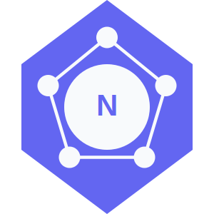

<!-- _coverpage.md -->

  

# Nucleux <small>1.4.0</small>

> Simple, atomic hub for all your React application's state management needs.

- **Zero boilerplate** - Write less, do more
- **No providers** - Use state anywhere without wrapping components
- **Atomic updates** - Only subscribed components re-render
- **Framework agnostic** - Works with or without React

[Get Started](#Nucleux)
[Demo Sandbox](https://codesandbox.io/p/sandbox/nucleux-react-qw58s4)
[GitHub](https://github.com/martyroque/nucleux/)
